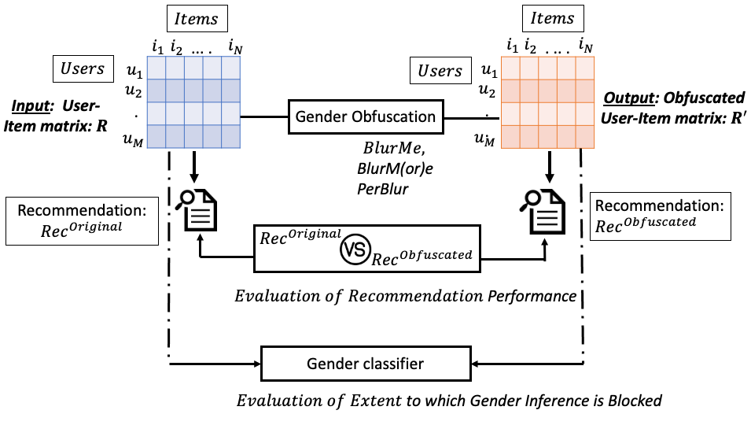

## Towards User-Oriented Privacy for Recommender System Data: A Personalization-based Approach to Gender Obfuscation for User Profiles

This repository releases the Python implementation of "PerBlur" in our paper "*Towards User-Oriented Privacy for Recommender System Data: A Personalization-based Approach to Gender Obfuscation for User Profiles*": [paper](http://google.com).
PerBlur stands for Personalized Blurring. 
PerBlur is an amelioration of:
  * *BlurM(or)e* (published in RMSE@RecSys'2019 Workshop): [paper](https://pure.tudelft.nl/portal/files/68758824/short2.pdf), [code](https://github.com/STrucks/BlurMore),
  * *BlurMe* (published in RecSys'2012): [paper](https://ece.northeastern.edu/fac-ece/ioannidis/static/pdf/2012/blurme.pdf).
  
  
The figure below presents the framework that we use to carry out our analysis of gender obfuscation and demonstrate the properties of our PerBlur approach. As shown in Figure (top), gender obfuscation takes the original user-item matrix R and transforms it into the obfuscated user-item matrix R'.
In order to be successful, gender obfuscation must fulfill two criteria.
First, as indicated by Evaluation of Recommendation Performance in Figure (middle), the quality of the predictions produced by the recommender system must be comparable for the original and the obfuscated data.
Second, as indicated by Evaluation of the Extent to Which Gender Information is Blocked in Figure (bottom), a gender classifier must no longer be able to use the obfuscated data to reliably predict the genders of the users.

# Python packages to install:
* For fancyimpute package we need scikit_learn==0.21.0
* Numpy
* Pandas
* scikit-learn

For recommender system algorithms (BPRMF and ALS) we used lenskit toolkit [lkpy](https://github.com/lenskit/lkpy). Further documentation on how to use Lenskit package can be found [here](https://lkpy.readthedocs.io/en/stable/)

Feel free to contact me at m.slokom@tudelft.nl or manel.slokom@live.fr for questions!
